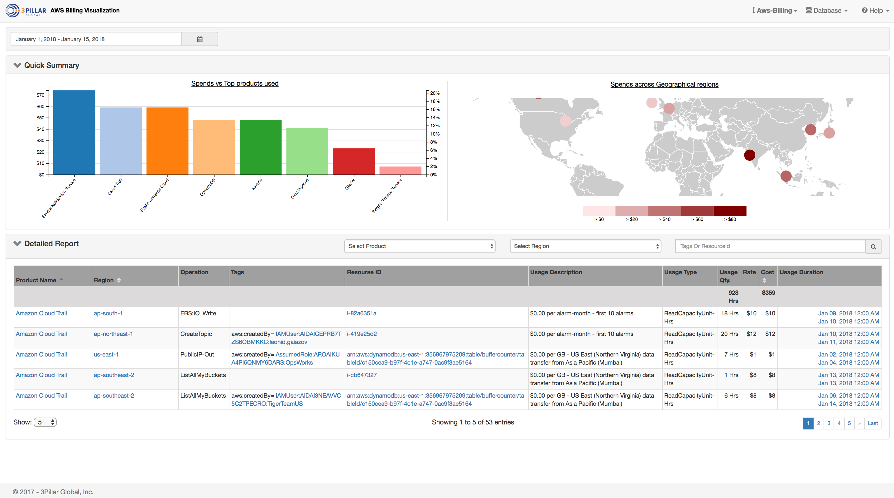

## AWS billing visualization

This aims help you to analyze AWS usage details, analyze how/where you can reduce costs and present a beautiful view of AWS resources usage in your account.
in product view, geographical view and data table view within date range.

Drill down is possible by:
* Date Range, so that you can see current month, last month and similar usage patterns. 
* Product filter, selecting product(s) which you want to see more details for.
* Geographical distribution, a heat map like geo map to see usage pattern accross regions where AWS data centers are.
* Tags & resource Id(s)- Tabular view allows you to filter by tags and resoruce id(s) to get more detailed data of specific resources.

There is a tour and help section which can help you further to use it once you are done past setup.
## Technology Stack
The core of system us build using Node JS, Angular2, ElasticSearch, D3, AWS lambda, Bootstrap 3, Font-Awesome.

## Setup 

* Manual Setup
  * Create a Lambda function in your AWS account (See followings steps or use standard practices to setup lambda function on AWS)
    * Sign in to the AWS Management Console and navigate to the AWS Lambda console.
    * Click on "Create a Lambda function"
    * Choose Blank function Blueprint by selecting runtime "Node.js 6.10".
    * Click Next button on Configure triggers.
    * Enter lambda function name and description and choose option "upload a zip file" from code entry type.
    * Upload lambda package zip
    * Enter Environment variables key:host and value will be elastic search domain endpoint.
    * Select appropriate role who have sufficient permission to call other lambda function and s3 bucket.
    * Click "Advanced Settings" and set memory value to 512.
    * Finally click "Create Function" and add trigger type s3 for event type "object created(All)".
  * Create Elastic Search Service domain (See following to setup AWS managed ES service or feel free to use ES setup from any box you already have)
    * Sign in to the AWS Management Console and navigate to the Elastic-search Service.
    * Click on "Create a new domain".
    * Enter domain name value and select Elastic Search version 5.3 and hit Next button.
    * Choose Instance count and instance type as per your uses and hit Next.
    * Once the domain is ready click on domain name that you have created.
    * Go to the kibana by clicking on link on kibana.
    * Select the dev tools
    * To create index and mapping copy given below json and paste in dev tool console and run.
    * Add mappings   
      PUT /aws-billing 
      {
          "settings": {
      		"index.mapping.ignore_malformed": true
      	},
      	"mappings": {
      		"atg-line-items-resources-tags": {
      			"properties": {
      				"ProductName": {
      					"type": "string",
      					"index": "not_analyzed"
      				},
      				"AvailabilityZone": {
      					"type": "string",
      					"index": "not_analyzed"
      				},
      				"UsageStartDate": {
      					"type": "date",
      					"format": "yyyy-MM-dd HH:mm:ss"
      				},
      				"UsageEndDate": {
      					"type": "date",
      					"format": "yyyy-MM-dd HH:mm:ss"
      				},
      				"BlendedCost": {
      					"type": "double"
      				},
                      "UsageQuantity": {
          				"type": "double"
      				},
      				"__CreatedDate": {
      					"type": "date",
      					"format": "yyyy-MM-dd HH:mm:ss"
      				},
      				"__AvailabilityRegion": {
      					"type": "string",
      					"index": "not_analyzed"
      				}
      			}
      		}
      	}
      }
  * Change host url of elastic-search in <project-root>/server/model/elasticsearch.js 
  * If needed you can change the port in server.js, default is 3000
  * In project folder, run npm install to get dependencies  
  * To start in development mode, npm run build
  * To start in production mode, npm run build-prod
  * Browse to http://<YOUR-SERVER-IP>:3000 to view in browser.
  
* Automated Install
  * This is still in development and is queued for next release.

## Unit testing
To run the test simply run "npm test" from project root directory , it will generate the coverage report under /coverage directory.

## License
(The MIT License)

Permission is hereby granted, free of charge, to any person obtaining
a copy of this software and associated documentation files (the
'Software'), to deal in the Software without restriction, including
without limitation the rights to use, copy, modify, merge, publish,
distribute, sublicense, and/or sell copies of the Software, and to
permit persons to whom the Software is furnished to do so, subject to
the following conditions:

The above copyright notice and this permission notice shall be
included in all copies or substantial portions of the Software.
